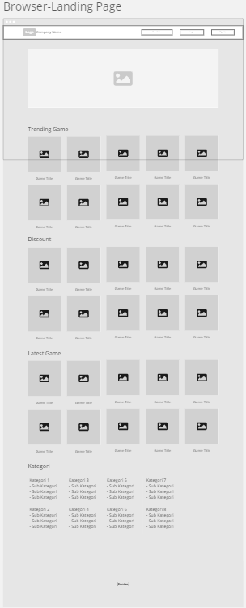

# UI UX
Week #2 Assignment

## Description

Contoh desain untuk website top up voucher game

<h1>URL</h1> 

## Miro: 

[Click Here](https://miro.com/app/board/uXjVPumu9Rk=/?share_link_id=806344847556)

## Figma: 

[Click Here](https://www.figma.com/file/vXSTdTRVgtUVoXOXulCuY7/WEEK-2-ASSIGNMENT?node-id=0%3A1&t=LaFKOq6OrNhtUlEX-1)

## Figma Prototype: 

[Click Here](https://www.figma.com/proto/vXSTdTRVgtUVoXOXulCuY7/WEEK-2-ASSIGNMENT?page-id=0%3A1&node-id=171%3A84&viewport=-2962%2C472%2C0.82&scaling=scale-down&starting-point-node-id=103%3A3&show-proto-sidebar=1)

<h1>Screenshot</>

## Miro

## Figma

